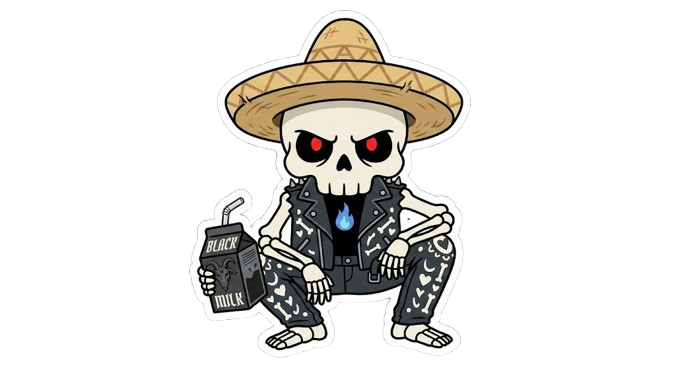

```coffeescript 
sudo sysctl -w kernel.kptr_restrict=2 && sudo sysctl -w kernel.perf_event_paranoid=3 && echo 3 | sudo tee /proc/sys/vm/drop_caches   
```

<br>
<p align="center">


<br>


</p>

#



I am a Intermediate Developer writing code since I was 9 years old, Currently tapping into the complex world of computers, networks and hardware.


I prioritize privacy over convenience, hardening my devices to find the thin line between security and usability without sacrificing my digital minimalism. I use ARCH, btw.


Know more about myself by taking a look over my [repositories](https://github.com/detoin?tab=repositories) and 
projects.

# <!-- Small line break, looking better than <hr/> -->

<br>


